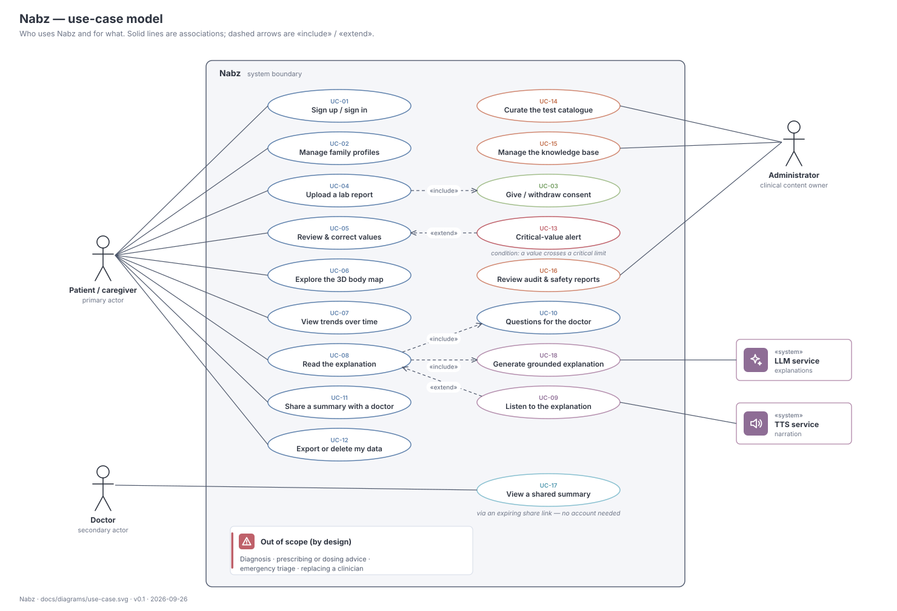

# 02 · Software requirements specification

| | |
|---|---|
| **Document ID** | NBZ-DOC-02 |
| **Version** | 0.3 |
| **Structure** | Adapted from ISO/IEC/IEEE 29148 |
| **Last updated** | 2026-10-03 |

## 1. Introduction

### 1.1 Purpose

This document specifies what Nabz must do (functional requirements) and how well it must do it (non-functional requirements). It is the contract between the project charter ([01](01-project-charter.md)) and the design documents ([03](03-system-architecture.md)–[06](06-detailed-design.md)). The test plan ([11](11-test-and-evaluation-plan.md)) traces every *Must* requirement to at least one test.

### 1.2 Scope

Nabz extracts, verifies, analyses, explains and visualises the results in a lab report. It is an informational tool. It **shall not** diagnose, recommend treatment or give dosing advice.

### 1.3 Definitions

| Term | Meaning |
|---|---|
| Observation | One extracted result: test name, value, unit, reference range and status. |
| Reference range | The interval the lab considers normal for this test (and often for this age and sex). |
| Critical value | A result so far outside the range that it needs prompt medical attention; handled by fixed rules. |
| RCV | Reference change value. The smallest difference between two results of the same person that is unlikely to be explained by analytical and normal biological variation. |
| Grounded explanation | Generated text that uses only confirmed values and retrieved, cited knowledge passages. |
| Profile | A person whose reports are managed in an account (self, parent, child…). |
| LOINC | Logical Observation Identifiers Names and Codes, the international code system for lab tests. |
| De-identified payload | Data sent to an external API with no name, ID, contact, image or exact date of birth. |

### 1.4 Priority scheme

MoSCoW: **M**ust (MVP fails without it) · **S**hould (expected at the demo) · **C**ould (if time permits) · **W**on't (this release).

## 2. Overall description

### 2.1 Product perspective

Nabz is a self-contained system: a web client, a REST API, an asynchronous worker and a PostgreSQL database, all run with Docker Compose. It depends on an external LLM API for explanations and, optionally, a TTS API. See the [architecture](03-system-architecture.md).

### 2.2 User classes

| User class | Description | Frequency | Technical skill |
|---|---|---|---|
| Patient | Adult managing their own reports | A few times a year | Low to medium, mostly on a phone |
| Caregiver | Manages reports for parents or children through family profiles | Monthly | Medium |
| Doctor | Opens a shared link with no account, or, with a clinician account an admin has verified, reads the reports families share with them and leaves notes | Occasional | High (domain) |
| Clinical reviewer | Clinical advisor: signs off critical limits and explanation templates; works the de-identified safety queue | Weekly | High (domain) |
| Administrator | Runs the system: users and roles, clinician verification, catalogue, knowledge base, jobs, audit log. No routine access to health data | Weekly | High |

### 2.3 Personas

**Priya (29, caregiver).** A software engineer in Bengaluru who manages her father's reports. She reads English and wants answers fast. Her father prefers Odia. See the [user journey map](05-workflows-and-interactions.md#6-user-journey).

**Ramesh (58, patient).** Lives in Bhubaneswar, has borderline blood sugar and a yearly check-up. He is comfortable with WhatsApp and prefers audio in Odia.

### 2.4 Operating environment

- **Client.** Current Chrome, Edge, Firefox or Safari on Android 10+, iOS 16+ or desktop. WebGL 2 is required for the 3D view, with a 2D fallback otherwise.
- **Server.** Docker Engine 25+ with Compose v2 on Windows 11 (WSL 2), macOS or Linux. 16 GB RAM, no GPU required.
- **Reference machine.** Intel i5-1235U, 16 GB RAM, Intel Iris Xe (the development laptop).

### 2.5 Design and implementation constraints

PostgreSQL is the only datastore. Every service runs in Docker. Python 3.12 is used for backend and ML, and React with TypeScript for the frontend. Raw report images and identities must not leave the host without explicit consent. The whole stack must work without a GPU.

### 2.6 Assumptions and dependencies

Reports are mostly printed in English. An LLM API with vision and good Indian-language output is available. A clinician reviews the explanation templates and critical-value table.

## 3. Use-case model

| ID | Use case | Primary actor | Brief description | Priority |
|---|---|---|---|---|
| UC-01 | Sign up / sign in | Patient / caregiver | Email or phone plus password; session via HTTP-only cookie | M |
| UC-02 | Manage family profiles | Patient / caregiver | Create, edit or delete profiles (name, sex, DOB, language) | M |
| UC-03 | Give / withdraw consent | Patient / caregiver | Per-purpose consent: processing, external AI, voice, research | M |
| UC-04 | Upload a lab report | Patient / caregiver | Photo or PDF with a quality check; includes UC-03 | M |
| UC-05 | Review & correct values | Patient / caregiver | Side-by-side check; low-confidence rows first | M |
| UC-06 | Explore the 3D body map | Patient / caregiver | Organs coloured by status; click for details | M |
| UC-07 | View trends over time | Patient / caregiver | Per-test chart, slope, change significance | M |
| UC-08 | Read the explanation | Patient / caregiver | Plain-language summary in EN, HI or OR; includes UC-10 and UC-18 | M |
| UC-09 | Listen to the explanation | Patient / caregiver | Narration; extends UC-08 | S |
| UC-10 | Questions for the doctor | Patient / caregiver | Generated checklist; printable | M |
| UC-11 | Share a summary with a doctor | Patient / caregiver | Expiring, revocable link | C |
| UC-12 | Export or delete my data | Patient / caregiver | JSON/PDF export; hard delete | M |
| UC-13 | Critical-value alert | System | Fixed urgent message; extends UC-05 | M |
| UC-14 | Curate the test catalogue | Administrator | Tests, aliases, units, ranges, critical limits | S |
| UC-15 | Manage the knowledge base | Administrator | Add or retire sources; re-embed | S |
| UC-16 | Review audit & safety reports | Administrator | Access log, validator failures, feedback | C |
| UC-17 | View a shared summary | Doctor | Read-only page through a share link | C |
| UC-18 | Generate grounded explanation | LLM service | Retrieval plus generation plus validation | M |
| UC-19 | Read a report shared with me | Doctor (clinician account) | Register and be verified; read shared reports; leave a note for the family | C |

## 4. Functional requirements

### 4.1 Accounts, profiles and consent

| ID | Requirement | Priority | Use case |
|---|---|---|---|
| FR-01 | The system shall let a user register and sign in with email or phone and a password. Passwords are hashed with Argon2id. | M | UC-01 |
| FR-02 | The system shall let a user create up to 10 profiles, each with display name, sex, date of birth, relationship and preferred language. | M | UC-02 |
| FR-03 | The system shall record consent per profile and per purpose (processing, external AI, voice, research) with the policy version, and shall let the user withdraw it at any time. | M | UC-03 |
| FR-04 | The system shall not process a report for a profile without active *processing* consent. It shall not call an external API for that profile without active *external AI* consent. | M | UC-03, UC-04 |
| FR-05 | For a profile of a minor (under 18), the system shall require the account holder to confirm they are the parent or lawful guardian before consent is recorded. | M | UC-02 |
| FR-39 | The system shall enforce role-based access for member, clinician, clinical reviewer and admin as specified in [12 §2](12-ux-and-access-design.md#2-roles-and-permissions); admin access to identifiable health data requires a recorded reason. | M | UC-01, UC-16 |
| FR-40 | The system shall verify a user's email before their first upload and support password reset by a single-use emailed token. | M | UC-01 |
| FR-41 | The system shall require a TOTP second factor for admin and clinical reviewer accounts. | S | UC-14–UC-16 |

### 4.2 Upload and extraction

| ID | Requirement | Priority | Use case |
|---|---|---|---|
| FR-06 | The system shall accept JPG, PNG, HEIC and PDF files up to 10 MB and 10 pages. | M | UC-04 |
| FR-07 | The system shall score image quality (blur, skew, glare, resolution) and show retake tips when the score is below threshold. | S | UC-04 |
| FR-08 | The system shall extract, for each result row, the test name, value, unit, reference range and any flag, plus the collection date and lab name. | M | UC-04 |
| FR-09 | The system shall map each extracted test to a catalogue entry (LOINC code) and flag unmapped rows as "not recognised" rather than guessing. | M | UC-04 |
| FR-10 | The system shall convert values to the catalogue's canonical unit and reject physiologically implausible values for review. | M | UC-04 |
| FR-11 | The system shall assign each row a calibrated confidence score and order rows below the threshold τ first on the review screen. | M | UC-05 |
| FR-12 | The system shall process a report asynchronously and show its status (queued → processing → needs review) to the client in real time. | M | UC-04 |

### 4.3 Review

| ID | Requirement | Priority | Use case |
|---|---|---|---|
| FR-13 | The system shall show every extracted value beside the report image and highlight its source region. | M | UC-05 |
| FR-14 | The system shall let the user edit, delete or add a value, and shall record who changed what and when. | M | UC-05 |
| FR-15 | The system shall not analyse or explain any value until the user confirms the report. | M | UC-05 |

### 4.4 Analysis

| ID | Requirement | Priority | Use case |
|---|---|---|---|
| FR-16 | The system shall classify each value as low, normal or high against the report's own range, or against the catalogue range for the profile's age and sex when the report has none. It shall label which source was used. | M | UC-06 |
| FR-17 | The system shall compare every value with a reviewed critical-limit table. On a match it shall show a fixed, non-generated "contact a doctor today" message before anything else. | M | UC-13 |
| FR-18 | For a test with a previous result, the system shall compute the reference change value and state whether the change is significant. | M | UC-07 |
| FR-19 | For a test with three or more results, the system shall compute a robust trend (Theil–Sen) and, where meaningful, the projected date of crossing a range limit. | M | UC-07 |
| FR-20 | The system shall show the profile's percentile relative to a reference population by age band and sex, and shall name the population used. | S | UC-07 |

### 4.5 Explanation

| ID | Requirement | Priority | Use case |
|---|---|---|---|
| FR-21 | The system shall generate a plain-language explanation that uses only the confirmed values, computed insights and retrieved knowledge passages, and shall cite the passages used. | M | UC-08, UC-18 |
| FR-22 | The system shall provide explanations in English and Hindi (Must) and Odia (Should). | M / S | UC-08 |
| FR-23 | Each explanation shall include a "questions to ask your doctor" list. | M | UC-10 |
| FR-24 | Every explanation shall pass the safety validator before display. On failure the system shall show a safe template built from the values alone. | M | UC-18 |
| FR-25 | The system shall send the external LLM only de-identified payloads: test, value, unit, range, age band and sex. | M | UC-18 |
| FR-26 | The system shall narrate the explanation in the selected language when voice consent is on. | S | UC-09 |
| FR-47 | The system shall answer a person's question about one report from its confirmed values and the knowledge base. Questions that ask for a diagnosis, a prediction or a treatment, ask for help in an emergency, try to redirect the assistant, or are not about the report's tests shall get a fixed reply decided by rules, without a model. A model's answer, where consent allows one, shall pass the same checks as an explanation (FR-24). | S | UC-08 |

### 4.6 Visualisation

| ID | Requirement | Priority | Use case |
|---|---|---|---|
| FR-27 | The system shall render a 3D body with each organ system coloured by the worst status among its tests. | M | UC-06 |
| FR-28 | Selecting an organ shall move the camera to it and open a card with its values, trends and explanation excerpt. | M | UC-06 |
| FR-29 | The system shall provide a timeline control that replays the body map across the profile's reports. | S | UC-07 |
| FR-30 | Selecting a row on the report image shall highlight the linked organ, and vice versa. | S | UC-05, UC-06 |
| FR-31 | Where WebGL 2 is unavailable, the system shall fall back to a 2D body diagram with the same information. | S | UC-06 |
| FR-42 | The system shall replay a person's confirmed reports as a story: one chapter per report, naming the turning points (first out of range, back in range, highest so far, beyond a critical limit) with exact values, never their cause. | C | UC-07 |

### 4.7 Sharing, export and data rights

| ID | Requirement | Priority | Use case |
|---|---|---|---|
| FR-32 | The system shall export all of a profile's data as JSON and a printable PDF summary. | M | UC-12 |
| FR-33 | The system shall hard-delete a report or profile on request: files, rows and derived data. Only a minimal audit entry remains. | M | UC-12 |
| FR-34 | The system shall create expiring (default 7 days), revocable read-only share links. | C | UC-11, UC-17 |
| FR-50 | The system shall let a family share a report with a clinician account whose medical-council registration an admin has verified. The clinician sees only reports shared with them, read-only, until the share is withdrawn; can leave notes the family sees beside the report; and every view is audited. Sharing with any other email shall answer as if no such account exists. | C | UC-11, UC-19 |

### 4.7a Everyday care

| ID | Requirement | Priority | Use case |
|---|---|---|---|
| FR-43 | The system shall keep reminders on dates the family chooses, optionally repeating; email the account on the day; and offer each as a calendar file. It shall never propose a date itself. | C | UC-10 |
| FR-44 | The system shall record readings taken at home (blood pressure, blood sugar, weight, pulse, temperature, oxygen level), refuse implausible values, and compare each reading only with a target the person enters. | C | UC-07 |
| FR-45 | The system shall print an emergency card with what the family typed (blood group, allergies, conditions, medicines, doctor, contacts) and the latest results outside their range, with a QR code holding the same text. | C | UC-12 |
| FR-46 | A new account shall be led through language, what Nabz is and is not, the first person with consent, the privacy choices and the first report, which may be a bundled sample. | S | UC-01, UC-02 |

### 4.8 Administration and operations

| ID | Requirement | Priority | Use case |
|---|---|---|---|
| FR-35 | Administrators shall manage tests, aliases, unit conversions, reference ranges and critical limits. Every change is logged with its previous value and applies without a restart. A change to a critical limit applies only after a clinical reviewer approves it, and approval re-checks the confirmed results of that test. | S | UC-14 |
| FR-36 | Administrators shall add knowledge documents with source, URL and licence, and trigger re-embedding. | S | UC-15 |
| FR-37 | The system shall log every read and write of health data in `audit_log`. | S | UC-16 |
| FR-38 | The system shall provide an offline mode that replays cached explanations and audio for the bundled sample reports. | M | — |
| FR-48 | Clinical reviewers shall see a de-identified queue of explanations the checks blocked, questions that got a fixed reply and explanations rated unhelpful, with what each check caught; record a verdict on each; try the checks on any text; and run the red-team suites on demand. | S | UC-18 |
| FR-49 | Staff shall see system health, counts, recent activity, the job monitor and the audit log, without any name, value or report; administrators shall also manage users and roles, unlock accounts, sign them out and retry failed jobs. | S | UC-14, UC-16 |
| FR-51 | The system shall publish, in English, Hindi and Odia and without an account: terms of use, the privacy notice, what Nabz is and is not, an about page listing every data source, model, font and library with its licence and the image credits, and a help page answering common questions. | S | — |

## 5. Non-functional requirements

| ID | Category | Requirement | Target | Verification |
|---|---|---|---|---|
| NFR-01 | Performance | Extraction time for a one-page report on the reference machine | p95 ≤ 30 s | Timed evaluation run |
| NFR-02 | Performance | Explanation time after confirmation (API mode) | p95 ≤ 20 s | Timed evaluation run |
| NFR-03 | Performance | 3D view frame rate on integrated graphics at 1080p | ≥ 45 fps | Browser performance panel |
| NFR-04 | Performance | Initial web load on a local network; body model size | ≤ 4 s; GLB ≤ 8 MB | Lighthouse, file size |
| NFR-05 | Accuracy | Field-level extraction accuracy before review | ≥ 95 % clean, ≥ 90 % photo | Evaluation set, [11 §4](11-test-and-evaluation-plan.md#4-ai-and-data-evaluation) |
| NFR-06 | Safety | Diagnostic or dosing statements in the red-team set | 0 | Red-team suite |
| NFR-07 | Safety | Critical values that trigger the fixed alert | 100 % | Unit tests over the limit table |
| NFR-08 | Privacy | External API payloads that contain direct identifiers | 0 | Payload inspection test |
| NFR-09 | Security | Baseline controls | OWASP ASVS 5.0 Level 1 | Checklist |
| NFR-10 | Portability | Whole stack starts with `docker compose up` on the reference machine | Yes | Fresh-clone test |
| NFR-11 | Resource | Total memory of all containers (with local LLM) | ≤ 7 GB | `docker stats` |
| NFR-12 | Usability | Readability of explanations (English) | Flesch-Kincaid grade ≤ 8 | Automatic scoring |
| NFR-13 | Usability | Accessibility | WCAG 2.2 AA for 2D views | axe-core + manual |
| NFR-14 | Localisation | All UI strings externalised; language switch without reload | EN, HI, OR | Review |
| NFR-15 | Maintainability | Static checks and test coverage on core logic | ruff + mypy clean; ≥ 80 % coverage on analysis and validation modules | CI |
| NFR-16 | Observability | Structured JSON logs with request and job IDs; per-stage timings | All services | Review |
| NFR-17 | Cost | External API spend per report (explanation, one language) | ≤ US$0.10 | Token accounting |
| NFR-18 | Availability (demo) | Demo flow works without internet using cached results | 3 / 3 rehearsals | Rehearsal log |

## 6. External interfaces

| Interface | Direction | Protocol | Notes |
|---|---|---|---|
| Web client ↔ API | both | HTTPS REST/JSON, Server-Sent Events for status | OpenAPI 3.1 generated by FastAPI |
| Worker → LLM API | out | HTTPS | De-identified payloads; structured JSON output |
| Worker → TTS API | out | HTTPS | Text plus language only |
| Worker → Ollama | internal | HTTP on the Compose network | Optional profile |
| Admin ↔ API | both | HTTPS REST | Role `admin` required |

## 7. Acceptance criteria (MVP)

1. All *Must* requirements pass their linked test cases in [11](11-test-and-evaluation-plan.md).
2. NFR-05, NFR-06, NFR-07 and NFR-08 meet their targets on the frozen evaluation set.
3. The demo script runs end to end, both online and offline, on the reference machine.

## Revision history

| Version | Date | Change |
|---|---|---|
| 0.1 | 2026-09-26 | First draft: 38 FRs, 18 NFRs, 18 use cases |
| 0.2 | 2026-10-03 | FR-42 – FR-49: story mode, reminders, home readings, emergency card, first-run walkthrough, questions about a report, the safety review and the system pages |
| 0.3 | 2026-10-03 | FR-50 doctors on Nabz and UC-19; FR-51 public information pages; FR-35 critical-limit changes need clinical review; doctor user class |
