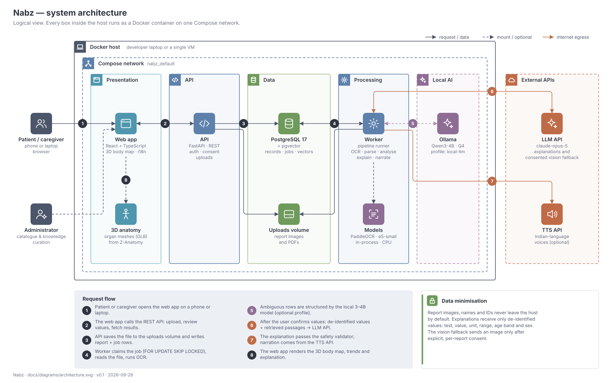
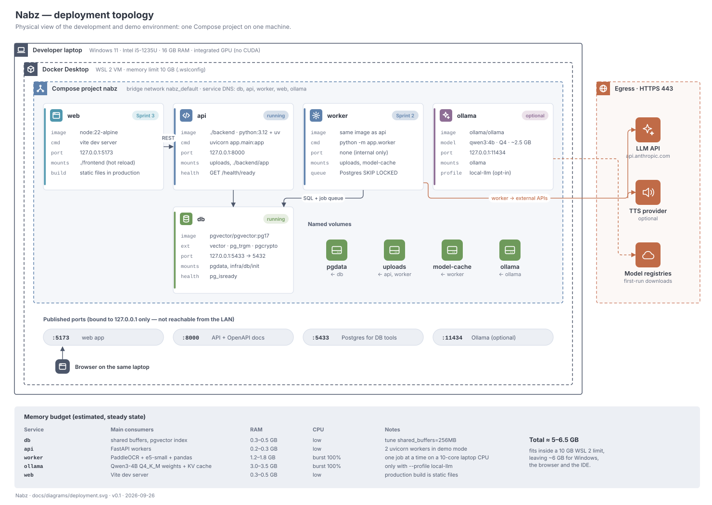

# 03 · System architecture

| | |
|---|---|
| **Document ID** | NBZ-DOC-03 |
| **Version** | 0.1 · draft |
| **Last updated** | 2026-09-26 |
| **Related** | [ADRs](adr/README.md) · [Data design](04-data-design.md) · [Detailed design](06-detailed-design.md) |

## 1. Architectural drivers

| Driver | Source | Architectural consequence |
|---|---|---|
| Runs on a 16 GB laptop with no CUDA GPU | Charter §8 | CPU-only OCR and embeddings; small local model at most; frontier model through an API |
| Health data is sensitive | Charter, DPDP Act | Data minimisation at the egress boundary; images and identifiers stay local |
| Wrong explanations can cause harm | SRS FR-17, FR-24 | Deterministic rules own anything safety-critical; the LLM only writes prose from verified inputs |
| Extraction is slow and bursty | NFR-01 | Asynchronous worker with a durable job queue; the API never blocks on OCR |
| One developer | Charter §8 | Few moving parts: one database (also the queue and vector store), one backend language, one Compose file |
| Everything in Docker, PostgreSQL only | Stakeholder decision | [ADR-0002](adr/0002-postgresql-single-datastore.md), [ADR-0003](adr/0003-docker-compose-for-all-environments.md) |

## 2. Principles

1. **Verify before you interpret.** Nothing is analysed or explained until a human confirms the numbers.
2. **Rules for safety, models for language.** Critical values, range classification and validation are plain code. Generative models write text; they never decide what is dangerous.
3. **Minimise what leaves the machine.** External calls carry de-identified values, not documents.
4. **Every stage is replaceable.** OCR, LLM, TTS, storage and queue sit behind interfaces ([06](06-detailed-design.md)).
5. **Boring infrastructure.** PostgreSQL does storage, queueing, full-text/fuzzy search and vector search.

## 3. Logical architecture



| Component | Responsibility | Technology |
|---|---|---|
| **Web app** | Upload, review screen, 3D body map, trends, explanation, admin console; EN/HI/OR UI | React + TypeScript + Vite, react-three-fiber, drei, Tailwind, Recharts, i18next |
| **3D anatomy asset** | Organ-system meshes with stable IDs, compressed | GLB derived from Z-Anatomy (CC BY-SA 4.0), Draco/meshopt |
| **API** | Auth, consent, profiles, uploads, status via SSE, results, admin CRUD; enqueues jobs | FastAPI, Pydantic v2, SQLAlchemy 2, Alembic |
| **Worker** | Runs pipeline stages: extract → (await review) → analyse → explain → narrate | Python 3.12 process, same image as the API |
| **PostgreSQL** | System of record, job queue (`FOR UPDATE SKIP LOCKED`), fuzzy alias search (`pg_trgm`), vector search (`pgvector`) | PostgreSQL 17 + pgvector 0.8 |
| **Uploads volume** | Original files and page images, addressed by random keys | Docker named volume |
| **Models (in-process)** | OCR and embedding models loaded by the worker | RapidOCR (PP-OCR models on ONNX Runtime), multilingual-e5-small |
| **Ollama** *(optional)* | Local 3–4B model for structuring ambiguous rows | Qwen3-4B-Instruct (Q4) |
| **LLM API** | Grounded explanations; safety judge; consent-gated vision fallback (separate vision model) | Groq API: `openai/gpt-oss-120b`; vision model for the fallback |
| **TTS API** *(optional)* | Narration in Indian languages | ElevenLabs, `eleven_multilingual_v2` ([ADR-0008](adr/0008-elevenlabs-for-narration.md)) |

The architecture diagram doubles as the **block diagram** in the college report. It numbers the request flow; [05](05-workflows-and-interactions.md) shows the same flow as pipeline, activity and sequence diagrams.

## 4. Why the API and the worker never talk directly

The API writes a `processing_job` row and returns `202 Accepted`. The worker claims jobs with:

```sql
UPDATE processing_job SET status = 'running', locked_at = now(), attempts = attempts + 1
WHERE id = (
  SELECT id FROM processing_job
  WHERE status = 'queued' AND run_after <= now()
  ORDER BY id
  FOR UPDATE SKIP LOCKED
  LIMIT 1)
RETURNING *;
```

This gives durable, transactional queueing with retries and back-off, without adding Redis or a broker. The client learns about progress through Server-Sent Events backed by `LISTEN/NOTIFY`. Several workers can run side by side without double-processing a job. See [ADR-0002](adr/0002-postgresql-single-datastore.md).

## 5. Deployment



- **One Compose project** (`compose.yaml` at the repository root) holds every service. `db` and `api` exist today. `worker` arrives in Sprint 2 and `web` in Sprint 3. `ollama` is behind the `local-llm` profile.
- **Ports bind to `127.0.0.1` only**, so nothing is exposed to the network the laptop is on.
- **Postgres listens on host port 5433** to avoid clashing with the PostgreSQL 18 already installed on the development machine.
- **Memory.** Set the WSL 2 limit to 10 GB in `%UserProfile%\.wslconfig` (`[wsl2] memory=10GB`). The full stack uses about 5–6.5 GB.
- **Commands.**

```bash
docker compose up --build -d
```

```bash
docker compose --profile local-llm up --build -d
```

Health checks: `GET http://localhost:8000/health` (liveness) and `GET /health/ready` (database and pgvector).

## 6. Technology stack

| Layer | Choice | Why this over the alternatives |
|---|---|---|
| Frontend | React 19 + TypeScript + Vite | Largest ecosystem for react-three-fiber; fast dev server |
| 3D | three.js via react-three-fiber, drei, postprocessing | Declarative scene graph; bloom and outline effects; good performance on integrated GPUs |
| Charts | Recharts | Simple, accessible SVG charts for trends |
| i18n | i18next | Mature; supports Devanagari and Odia script fonts |
| API | FastAPI + Pydantic v2 | Async, typed, automatic OpenAPI; same language as the ML code |
| ORM / migrations | SQLAlchemy 2 + Alembic | Explicit SQL control (needed for SKIP LOCKED, pgvector) |
| Packaging | uv | Fast, reproducible lockfile (`backend/uv.lock`) |
| Database | PostgreSQL 17 + pgvector, pg_trgm, pgcrypto, citext | One store for records, queue, fuzzy search and vectors ([ADR-0002](adr/0002-postgresql-single-datastore.md)) |
| PDF text + OCR | pypdfium2 text layer first; RapidOCR (PaddleOCR models on ONNX Runtime) + OpenCV for scans and photos | Digital PDFs are read exactly; OCR only where needed, CPU-only, Apache-2.0 ([ADR-0009](adr/0009-text-layer-first-and-rapidocr.md)) |
| ML / DS | scikit-learn, SciPy, statsmodels, pandas, rapidfuzz | Calibrated classifiers, robust statistics, fuzzy matching |
| Embeddings | intfloat/multilingual-e5-small (384-d) | Multilingual (EN/HI/OR), 118 M parameters, runs on CPU |
| LLM (explanations) | Groq API, `openai/gpt-oss-120b` | See §7 and [ADR-0007](adr/0007-groq-gpt-oss-for-explanations.md) |
| LLM (local) | Ollama + Qwen3-4B-Instruct | Apache-2.0; enough for short structuring tasks on CPU |
| Containers | Docker Desktop (WSL 2) + Compose v2 | Stakeholder requirement; identical setup for every machine ([ADR-0003](adr/0003-docker-compose-for-all-environments.md)) |
| Quality | ruff, mypy, pytest, Playwright, GitHub Actions | Linting, typing, unit/integration and end-to-end tests in CI |

## 7. LLM strategy and model sizing

**Can a 3B-parameter model do the job?** Only one part of it. Nabz has five language/vision tasks with very different needs. The development laptop has no CUDA GPU, so any local model runs on the CPU.

| Task | What it needs | Smallest model that does it well | Runs where | Decision |
|---|---|---|---|---|
| Read text from the report | PDF text layer; for scans and photos, text detection and recognition | Not an LLM: PDFium text layer, else PaddleOCR models via RapidOCR (tens of MB) | Worker, CPU: text layer < 0.1 s, OCR about 7–10 s per page | **Local** |
| Structure ambiguous rows ("S. Creat 1.1 mg/dl 0.7-1.3") into JSON; resolve unknown aliases | Short text in, schema-constrained JSON out | **3–4B instruct model** (Qwen3-4B-Instruct, about 2.5 GB at 4-bit) | Ollama, CPU, about 20–60 s per batch of rows | **Local (optional)**: rules and fuzzy matching handle most rows first |
| Read a table straight from a hard photo (skewed, folded, multi-column) | Vision-language understanding | About **7–8B vision-language model** (Qwen2.5-VL-7B / Qwen3-VL-8B class), roughly 6–8 GB of GPU memory | Not practical on this CPU | **API vision model on Groq** (`VISION_MODEL`), only after per-report consent; gpt-oss-120b is text-only |
| Explain results in English, Hindi and Odia; write doctor questions | Faithful grounding, medical nuance, fluent Indic output, reliable JSON | Frontier-class. Open models below about 30B are noticeably weaker in Hindi and weak in Odia | — | **API** (`openai/gpt-oss-120b` on Groq) |
| Safety judge (second opinion on generated text) | Spot diagnosis, dosing or number mismatches | Same API model at low effort | — | **API**, backed by deterministic rules |
| Semantic search over the knowledge base | Multilingual embeddings | 118M-parameter embedding model | Worker, CPU | **Local** |

**Summary.** Run a 3–4B local model for row structuring, and use an API model (`openai/gpt-oss-120b` on Groq, [ADR-0007](adr/0007-groq-gpt-oss-for-explanations.md)) for anything a patient reads. That covers explanations, Hindi and Odia, and the safety judge. OCR and embeddings are small specialised models, not LLMs. Everything sits behind an `LLMProvider` interface ([06](06-detailed-design.md)), so the local-versus-API split is a configuration change (`LLM_PROVIDER`, `LOCAL_LLM_MODEL` in `.env`).

**Cost.** One explanation uses roughly 5k input tokens (instructions, values, retrieved passages) and 1.5k output tokens. At Groq's list price for `openai/gpt-oss-120b` (about $0.15 per million input and $0.75 per million output tokens at the time of writing; check groq.com/pricing), that is well under **US$0.01 per report per language**. The whole project's traffic stays far below the US$30 budget.

**Privacy.** The explanation call receives only `{test, value, unit, range, status, trend, age band, sex}` plus retrieved passages. The vision fallback is the only path that sends an image, and it requires explicit per-report consent ([10](10-safety-privacy-compliance.md)).

Full reasoning is in [ADR-0004](adr/0004-hybrid-llm-strategy.md).

## 8. AI and data-science components

| Component | Technique | Trained on or configured from | Output |
|---|---|---|---|
| Image quality score | Laplacian variance (blur), Hough-line skew, highlight ratio | Thresholds tuned on the photo evaluation set | 0–1 score and retake tips |
| Row parser | Line grouping + segment classification (name, value, flag, unit, range); no fixed columns, so any layout works | Synthetic reports | Draft rows |
| Catalogue matcher | Alias lookup → trigram similarity (`pg_trgm`) → local LLM fallback | Test catalogue aliases | LOINC code and match score |
| Confidence model | Calibrated logistic regression over OCR confidence, match score, plausibility and unit agreement | Synthetic + photographed set, labelled automatically from ground truth | Probability the row is correct; rows below τ are reviewed first |
| Change detector | Reference change value from analytical and within-subject biological variation (EFLM data) | Biological-variation table in the catalogue | Significant / not significant |
| Trend analyser | Theil–Sen slope, projection to range limits, bootstrap interval | The profile's own history | Slope per year, projected crossing date |
| Percentile service | Survey-weighted percentiles by age band and sex | NHANES laboratory files | Percentile and population label |
| Retriever | Dense retrieval (e5-small) + test-ID filter, top-k | Curated knowledge base | Cited passages |
| Explainer | Structured-output generation with citations | Prompt + passages + values | JSON explanation |
| Safety validator | Rules (banned intents, number match, required disclaimers) + LLM judge | Red-team suite | Pass / fallback |

## 9. Security architecture (summary)

- **Auth.** Argon2id password hashes; short-lived session in an HTTP-only, SameSite=Strict cookie; CSRF token for state-changing requests.
- **Authorisation.** Every query is scoped by `owner_user_id`, and an admin role guards catalogue and knowledge endpoints. Row ownership is re-checked in the service layer.
- **Data at rest.** The Docker volumes live on the encrypted host disk (BitLocker on the demo laptop). Direct identifiers (name, phone, DOB) are encrypted with `pgcrypto`. File keys are random UUIDs.
- **Data in transit.** HTTPS to external APIs. The local network is not exposed because ports bind to 127.0.0.1.
- **Secrets.** API keys live only in `.env` (git-ignored) and container environment variables.
- **Input handling.** Uploads are type-sniffed (not trusted by extension), size-limited and decoded in the worker only. PDFs are rasterised and never executed.
- **Audit.** `audit_log` records every access to health data.

The threat model is in [10 §5](10-safety-privacy-compliance.md#5-threat-model-stride).

## 10. Quality attributes → tactics

| Attribute | Tactic |
|---|---|
| Performance | Async jobs; one-time model load per worker; image downscaling before OCR; GLB compression and lazy organ detail |
| Reliability | Transactional queue with retries and back-off; idempotent stages keyed by report ID; health checks with `depends_on` |
| Safety | Human confirmation gate; rule-based critical values; validator with safe fallback template |
| Privacy | De-identified egress; consent checks in the service layer; hard delete |
| Modifiability | Provider interfaces; catalogue and knowledge base are data, not code |
| Demo resilience | Offline mode replays cached explanations and audio; sample reports bundled |

## Revision history

| Version | Date | Change |
|---|---|---|
| 0.1 | 2026-09-26 | First draft |
