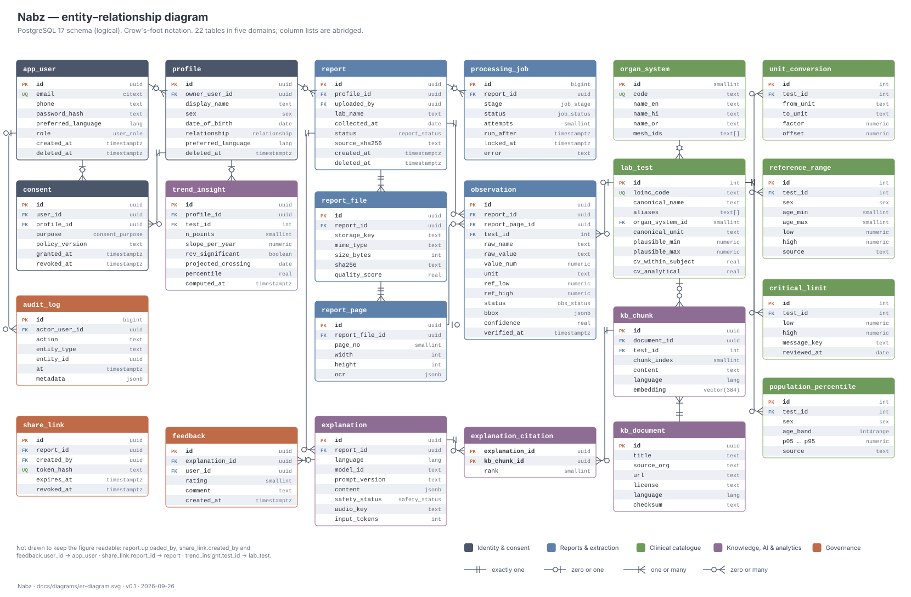

# 04 · Data design

| | |
|---|---|
| **Document ID** | NBZ-DOC-04 |
| **Version** | 0.1 · draft |
| **Database** | PostgreSQL 17 with `vector`, `pg_trgm`, `pgcrypto`, `citext` |
| **Last updated** | 2026-09-26 |

## 1. Principles

- **PostgreSQL is the single source of truth** for records, the job queue, alias search and embeddings ([ADR-0002](adr/0002-postgresql-single-datastore.md)). Files live on the `uploads` volume and are referenced by `storage_key`.
- **Raw and interpreted values are both kept.** `observation.raw_*` stores what the report said, and the typed columns store what we understood. This allows audits and re-processing.
- **Catalogue is data.** Tests, aliases, units, ranges and critical limits are rows administrators can edit, not code constants.
- **UUID primary keys** for user-facing entities (not guessable), and integer keys for catalogue tables.
- **Soft delete only where the law needs a trail.** A deletion request removes content immediately. `deleted_at` exists only so the nightly purge can confirm file removal before dropping rows.
- **Schema changes go through Alembic migrations**, never manual DDL. `infra/db/init` only enables extensions.

## 2. Entity–relationship diagram

The account tables added in Sprint 6 (`user_session`, `auth_token` and the new `app_user` columns) are in §5.7; the design behind them is in [12 §3](12-ux-and-access-design.md#3-authentication).

## 3. Table catalogue

| Domain | Table | Purpose | Approx. rows (pilot) |
|---|---|---|---|
| Identity & consent | `app_user` | Account holder; login identity, role, email confirmation, two-step sign-in, lockout | 10s |
| | `user_session` | Server-side session: token hash, CSRF token, last seen, revoked | 100s |
| | `auth_token` | Single-use email tokens (confirm email, reset password), hashed, with expiry | 100s |
| | `profile` | Person whose reports are managed (self, parent, child) | 10s |
| | `consent` | Per-profile, per-purpose consent with policy version | 100s |
| Reports & extraction | `report` | One uploaded lab report and its lifecycle status | 100s |
| | `report_file` | Original file metadata; the file itself is on the volume | 100s |
| | `report_page` | Page size in points and reader output (JSONB: `source`, `quality`, `skew` angle, tokens) | 100s |
| | `processing_job` | Durable queue item per pipeline stage | 1,000s |
| | `health_record` | Other records kept with the reports (imaging, prescription, discharge, vaccination): the file, and for imaging the study image and the report's title, findings, impression and image credit (`study` JSONB). Stored, never analysed | 100s |
| | `observation` | One result row: raw text, typed value, range, status, confidence | 10,000s |
| Everyday care | `reminder` | A reminder the family set: title, date, repeat in months, note; emailed on the day, done or not | 100s |
| | `home_reading` | A reading taken at home: kind, one number (two for blood pressure), context, time | 1,000s |
| Clinical catalogue | `organ_system` | Organ systems and their 3D mesh IDs | ~15 |
| | `lab_test` | Supported tests: LOINC code, aliases, canonical unit, biological variation | ~60 → 150 |
| | `unit_conversion` | Unit → canonical unit factors per test | ~200 |
| | `reference_range` | Default ranges by sex and age when the report has none | ~300 |
| | `critical_limit` | Clinician-reviewed critical thresholds | ~40 |
| | `population_percentile` | NHANES percentiles by sex and age band (966 cells, 46 tests) | ~1,000 |
| Knowledge, AI & analytics | `kb_document` | Knowledge source with licence and URL | ~150 |
| | `kb_chunk` | Retrieval passage with 384-d embedding | ~3,000 |
| | `explanation` | Generated explanation (JSON), model and prompt version, safety status | 100s |
| | `explanation_citation` | Which passages an explanation cited | 1,000s |
| | `report_question` | A question asked about a report and the reply: how it was answered, why a fixed reply, sources, any blocked model text (for the reviewer only) | 1,000s |
| | `trend_insight` | Latest change, trend (direction, confirmed, projected crossing) and percentile per profile × test, linked to the latest result | 1,000s |
| Governance | `share_link` | Expiring read-only links for doctors: hashed token, who it is for, how often opened | 10s |
| | `safety_review` | A clinical reviewer's verdict (right or wrong call, note) on a blocked explanation, a question's reply or an unhelpful rating | 100s |
| | `feedback` | Thumbs up/down and comments on explanations | 100s |
| | `audit_log` | Append-only access and change log | 10,000s |

## 4. Enumerations

| Type | Values |
|---|---|
| `report_status` | `uploaded`, `rejected`, `queued`, `processing`, `needs_review`, `verified`, `analysing`, `explaining`, `explained`, `failed`, `deleted` |
| `job_stage` | `extract`, `analyse`, `explain`, `narrate` |
| `job_status` | `queued`, `running`, `succeeded`, `failed` |
| `obs_status` | `low`, `normal`, `high`, `critical_low`, `critical_high`, `unknown` |
| `consent_purpose` | `processing`, `external_ai`, `voice`, `research` |
| `safety_status` | `passed`, `fallback`, `blocked` |
| `sex` | `female`, `male`, `other`, `unknown` (reference ranges fall back to sex-neutral when not `female`/`male`) |
| `lang` | `en`, `hi`, `or` |
| `user_role` | `user`, `clinician`, `reviewer`, `admin` (reviewer and admin are staff: two-step sign-in required, 1-day sessions) |
| `token_purpose` | `verify_email`, `reset_password` |
| `record_kind` | `imaging`, `prescription`, `discharge`, `vaccination`, `other` |
| `reading_kind` | `bp`, `glucose`, `weight`, `pulse`, `temperature`, `spo2` |

## 5. Data dictionary: core tables

### 5.1 `report`

| Column | Type | Null | Description |
|---|---|---|---|
| `id` | uuid | no | PK, `gen_random_uuid()` |
| `profile_id` | uuid | no | FK → `profile.id`, `ON DELETE CASCADE` |
| `uploaded_by` | uuid | no | FK → `app_user.id` |
| `lab_name` | text | yes | As printed; extracted |
| `collected_at` | date | yes | Sample collection date; extracted, user-confirmed |
| `status` | report_status | no | See [state machine](05-workflows-and-interactions.md#5-report-lifecycle) |
| `source_sha256` | text | no | Hash of the original file; detects duplicate uploads per profile |
| `created_at` | timestamptz | no | default `now()` |
| `deleted_at` | timestamptz | yes | Set on delete request; purge job removes the row |

Indexes: `(profile_id, collected_at DESC)`; unique `(profile_id, source_sha256)` where `deleted_at IS NULL`.

### 5.2 `observation`

| Column | Type | Null | Description |
|---|---|---|---|
| `id` | uuid | no | PK |
| `report_id` | uuid | no | FK → `report.id`, cascade |
| `report_page_id` | uuid | yes | FK → `report_page.id`; null for rows added by hand |
| `test_id` | int | yes | FK → `lab_test.id`; null = not recognised |
| `raw_name`, `raw_value`, `raw_unit`, `raw_range` | text | yes | Exactly as read |
| `raw_flag` | text | yes | Flag printed on the report (`H` / `L`); cross-checked against the computed status |
| `section` | text | yes | Panel code of the report section the row appeared in (`cbc`, `lipid`, …); context for the catalogue matcher |
| `value_num` | numeric | yes | Parsed value in canonical unit |
| `unit` | text | yes | Canonical unit |
| `ref_low`, `ref_high` | numeric | yes | Range in canonical unit |
| `ref_source` | text | no | `report` or `catalogue` |
| `status` | obs_status | no | From the classifier |
| `bbox` | jsonb | yes | `{page, x0, top, x1, bottom}` in page points (OCR'd pages: the deskewed frame); the review screen draws it as fractions of the page |
| `confidence` | real | no | Calibrated probability that the row is right, 0–1, from the row-confidence model; 1.0 after a consistent manual edit |
| `ocr_confidence` | real | yes | Reader confidence for the row (1.0 for the PDF text layer); a model input, kept separate from `confidence` |
| `match_score` | real | yes | Catalogue-matcher score for the chosen test, 0–1 |
| `match_method` | text | yes | `exact`, `fuzzy`, `resolver`, `manual` or `none` |
| `match_candidates` | jsonb | yes | Up to three `[test_code, score]` pairs offered on the review screen when the match is not certain |
| `verified_at` | timestamptz | yes | Set when the user confirms the report |
| `edited` | boolean | no | True if the user changed any field |
| `analysis` | jsonb | yes | Analysis as of this report's date: previous result, change and RCV verdict, trend, percentile, printed-flag disagreement. Written by the analysis stage (schema version 1, `app/services/analysis.py`) |

Indexes: `(report_id)`; `(test_id)`; history query uses `report.profile_id` + `test_id` via a join on the indexed report columns.

### 5.3 `lab_test`

| Column | Type | Description |
|---|---|---|
| `id` | int | PK |
| `code` | text | Unique stable slug used by seeds and code (e.g. `hba1c`) |
| `loinc_code` | text | Unique LOINC code (e.g. `4548-4` for HbA1c); check digit validated on load |
| `short_name`, `panel` | text | Display label and report section (`cbc`, `lipid`, `liver`, …) |
| `canonical_name` | text | Display name in English; translations in the i18n bundle |
| `aliases` | text[] | Spellings seen on Indian reports ("HbA1c", "Glycated Haemoglobin", "GHb"…). Matched in memory with rapidfuzz, as the catalogue is small; `pg_trgm` stays available for admin search |
| `organ_system_id` | smallint | FK → `organ_system.id`; drives the 3D colouring |
| `canonical_unit` | text | UCUM unit |
| `plausible_min`, `plausible_max` | numeric | Physiological bounds for sanity checks (not reference ranges) |
| `cv_analytical`, `cv_within_subject` | real | Biological-variation inputs for RCV |

### 5.4 `processing_job`

| Column | Type | Description |
|---|---|---|
| `id` | bigint | PK, identity |
| `report_id` | uuid | FK → `report.id`, cascade |
| `stage` | job_stage | Which handler runs it |
| `status` | job_status | Queue state |
| `attempts` | smallint | Incremented on claim; three attempts maximum |
| `run_after` | timestamptz | Back-off: `now() + 2^attempts × 10 s` |
| `locked_at` | timestamptz | Stale-lock recovery after 10 min |
| `error` | text | Last error message (no health data) |
| `args` | jsonb | Stage options, e.g. `{"lang": "hi"}` for an explanation in another language; never health data |

Partial index: `(run_after) WHERE status = 'queued'`.

### 5.5 `explanation`

| Column | Type | Description |
|---|---|---|
| `content` | jsonb | `{language, summary, per_test[], doctor_questions[], disclaimer_key, sources[], meta}`; schema versioned by `prompt_version`. `meta` records the source (`model` or `template`), why the template was used, the problem codes, and any rejected draft for the clinical reviewer (never shown to the reader) |
| `model_id` | text | e.g. `openai/gpt-oss-120b` or `template` for the safe fallback |
| `safety_status` | safety_status | Validator result |
| `input_tokens`, `output_tokens`, `latency_ms` | int | Cost and performance accounting |
| `audio_key` | text | Storage key of the narration, if any |

### 5.6 `kb_chunk`

| Column | Type | Description |
|---|---|---|
| `embedding` | vector(384) | multilingual-e5-small, normalised; HNSW index with `vector_cosine_ops` |
| `test_id` | int | Optional filter so retrieval stays on-topic |
| `language` | lang | Passages can be English originals or reviewed translations |

### 5.7 Accounts and sessions (Sprint 6)

| Table · column | Type | Description |
|---|---|---|
| `app_user.password_hash` | text | Argon2id (argon2-cffi defaults); rehashed on sign-in when the parameters change |
| `app_user.email_verified_at` | timestamptz | Set by the emailed link; uploads are refused until then |
| `app_user.totp_secret_enc` · `totp_enabled_at` | text · timestamptz | TOTP secret encrypted with Fernet (key derived from `SECRET_KEY`); the secret is set at set-up and counts only once enabled |
| `app_user.failed_logins` · `locked_until` | smallint · timestamptz | Five wrong passwords lock the account for 15 minutes |
| `user_session.token_hash` | text, unique | SHA-256 of the cookie token; the token itself is never stored |
| `user_session.csrf_token` | text | Sent back in `X-CSRF-Token` on every change |
| `user_session.last_seen_at` · `revoked_at` | timestamptz | Idle expiry (14 days, 1 day for staff) and sign-out; `last_seen_at` is written at most every 5 minutes |
| `auth_token.token_hash` · `purpose` · `expires_at` · `used_at` | text · token_purpose · timestamptz | Emailed tokens, SHA-256 at rest, single use (confirm: 24 hours; reset: 30 minutes) |

### 5.8 Care, questions and review (after Sprint 6)

| Table · column | Type | Description |
|---|---|---|
| `profile.emergency` | jsonb | The emergency card as typed: blood group, allergies, conditions, medicines, doctor, up to three contacts |
| `profile.reading_targets` | jsonb | The person's own target per reading kind (`low`, `high`; `high2` for the lower blood-pressure number) |
| `reminder.due_on` · `repeat_months` · `sent_at` · `done_at` | date · smallint · timestamptz | Marking a repeating reminder done creates the next one; the worker emails each once on its date |
| `home_reading.value` · `value2` · `context` · `taken_at` | numeric · numeric · text · timestamptz | `value2` only for blood pressure; implausible values are refused by the API |
| `report_question.mode` · `refusal` | text | `model`, `knowledge` (rules) or `refusal`; the refusal kind (`diagnosis`, `treatment`, `emergency`, `instruction`, `not_in_report`, `off_topic`, `cannot_answer`) |
| `report_question.meta` | jsonb | Why rules answered instead of the model, the problem codes, and any blocked model answer for the reviewer |
| `safety_review.subject_type` · `subject_id` | text · uuid | `explanation`, `question` or `feedback` and its id; the latest verdict is the current one |
| `share_link.label` · `views` · `last_viewed_at` | text · int · timestamptz | Who the link is for, as the owner wrote it, and how it has been used |

## 6. Retention and deletion

| Data | Retention | Mechanism |
|---|---|---|
| Report files, pages, observations, explanations, narration audio | Until the user deletes the report, the person or the account | Hard delete at once (FR-33): rows through foreign-key cascades, then the stored uploads and audio; only an audit entry without health data remains |
| Other records (files, study images) | Until the user deletes the record, the person or the account | Hard delete with the person or account; both the file and the study image go |
| Reminders, home readings, emergency details, questions and share links | Until the user deletes them, the report, the person or the account | Hard delete through the same cascades; included in the export |
| Safety reviews | Project lifetime | De-identified verdicts and notes; no link back to a person once the subject is deleted |
| Sessions and email tokens | Until sign-out, expiry or account deletion | Revoked rows are kept for the account's lifetime; deleted with the account |
| Consent records | Account lifetime + 1 year (evidence of consent) | Kept after withdrawal, marked `revoked_at` |
| `audit_log` | 1 year | Monthly partition drop |
| Evaluation datasets (synthetic) | Project lifetime | In the repository (`data/synthetic`) |
| Consented real samples | Until M3 + 30 days | Encrypted folder outside git (`data/private`); deleted after evaluation |

## 7. Migrations and seed data

- Alembic revision per change, named `YYYYMMDD_short_description`.
- Seed data comes from CSV files in [`data/catalogue/`](../data/catalogue/README.md) (10 organ systems, 70 tests, unit conversions, default ranges, critical limits, population percentiles). It is validated on load (LOINC check digits, units, bounds) and loaded by an idempotent command: `python -m app.cli seed-catalogue`. The catalogue CSV is reviewed like code.
- The knowledge base is loaded by an ingestion command that records licence and checksum in `kb_document`, chunks the text (about 300 tokens with 15 % overlap), embeds it and writes to `kb_chunk`.

## Revision history

| Version | Date | Change |
|---|---|---|
| 0.1 | 2026-09-26 | First draft: 22 tables |
| 0.2 | 2026-09-27 | `observation`: `raw_flag`, `section` (Sprint 2); `ocr_confidence`, `match_score`, `match_method`, `match_candidates` and the `bbox` format (Sprint 3); `report_page.ocr.skew` |
| 0.3 | 2026-09-28 | `observation.analysis`; `trend_insight.direction`, `confirmed`, `last_observation_id`; percentiles seeded from NHANES |
| 0.4 | 2026-09-30 | `processing_job.args`; `explanation.content` sources and meta; knowledge base loaded (46 documents, 436 passages) |
| 0.6 | 2026-09-30 | `health_record` and `record_kind`; `report.note` (the person's own note) |
| 0.7 | 2026-10-03 | `reminder`, `home_reading`, `report_question`, `safety_review`; `profile.emergency` and `reading_targets`; `share_link` label and views; `reading_kind`; §5.8; retention of the new data |
| 0.5 | 2026-09-30 | §5.7 accounts and sessions: `user_session`, `auth_token`, `app_user` columns, `user_role` and `token_purpose` values; §6 hard deletion as built |
