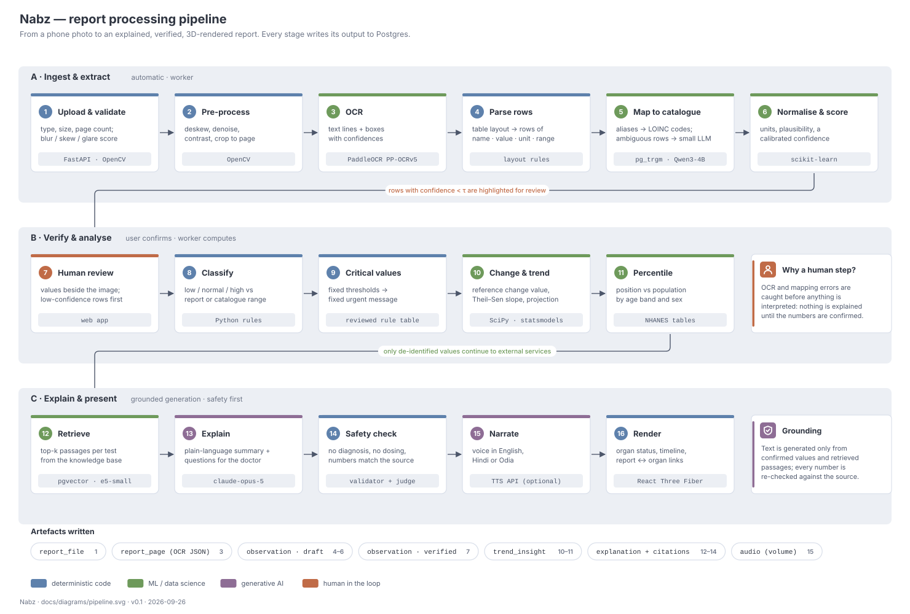
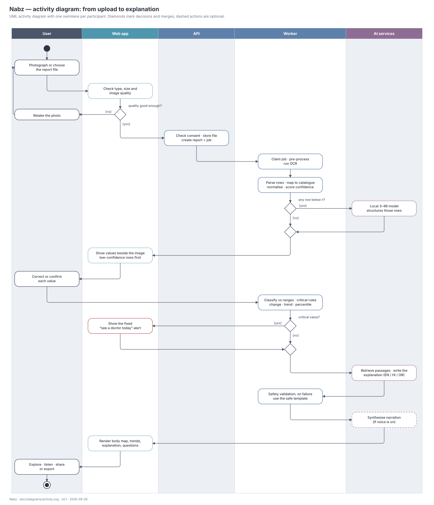
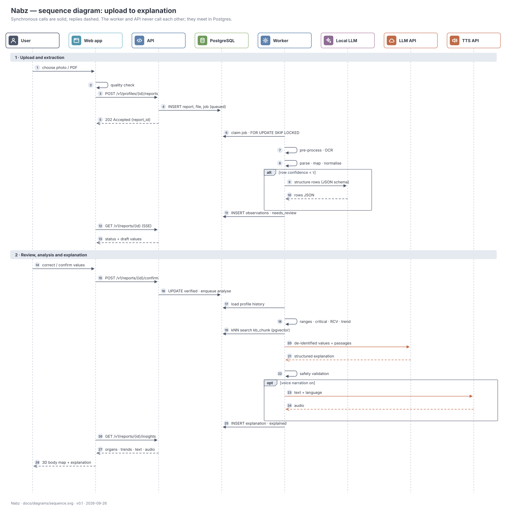
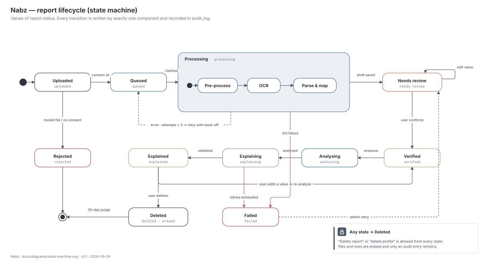
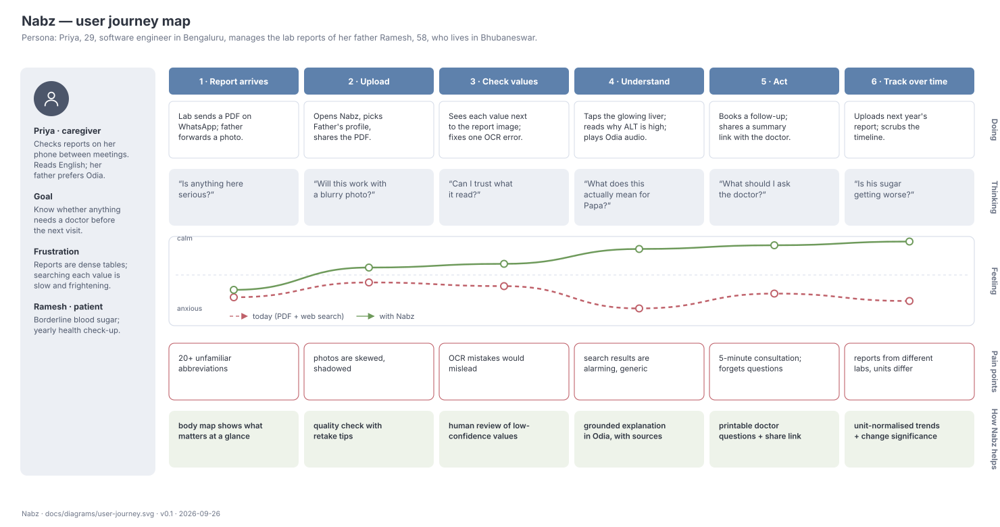

# 05 · Workflows and interactions

| | |
|---|---|
| **Document ID** | NBZ-DOC-05 |
| **Version** | 0.1 · draft |
| **Last updated** | 2026-09-26 |

This document shows the same core flow (a report goes from photo to explanation) at five levels of detail. It covers the processing pipeline, the activity diagram, the message sequence, the report state machine and the user's journey.

## 1. Workflow overview

| View | Question it answers | Figure |
|---|---|---|
| Processing pipeline | What happens to the data, stage by stage? | §2 |
| Activity diagram | Who does what, in which order, with which decisions? | §3 |
| Sequence diagram | Which component calls which, with what message? | §4 |
| State machine | What statuses can a report be in? | §5 |
| User journey | How does it feel for the person using it? | §6 |

## 2. Report processing pipeline

The pipeline runs in three bands:

- **A · Ingest & extract** (automatic, worker). A photo becomes draft rows with a confidence score each. Rules handle what they can: layout parsing, unit conversion, plausibility. ML handles uncertainty: OCR, fuzzy matching and the confidence model. The local small model is used only for rows the rules could not structure.
- **B · Verify & analyse.** The human-review step is a deliberate gate. After confirmation, classification and critical-value checks are deterministic. Change significance (RCV), trends and percentiles are statistical.
- **C · Explain & present.** Retrieval narrows the knowledge base to the tests on the report. The LLM writes structured JSON. The validator checks it before anything is shown, and falls back to a template on failure.

Each stage writes to Postgres and is idempotent, so a retry never duplicates rows.

## 3. Activity diagram

Three decisions shape the flow:

1. **Quality gate** (web app). A blurry or skewed photo is rejected before upload, with tips. This saves a slow round trip.
2. **Confidence gate** (worker). Only rows below τ go to the local model and are placed first in the review list.
3. **Critical-value gate** (worker). A critical result shows a fixed alert in the web app immediately. The rest of the flow still runs, so the user also gets context.

## 4. Sequence diagram

Notes:

- Messages 3–5 and 15–16 are the only synchronous API calls in the heavy path. Everything slow happens in the worker.
- Status updates (12–13) use Server-Sent Events, fed by Postgres `LISTEN/NOTIFY` on job completion.
- Message 20 is the only place health data leaves the host by default, and it is de-identified ([10](10-safety-privacy-compliance.md)).

### 4.1 REST endpoints used in the flow

| # | Method and path | Purpose | Response |
|---|---|---|---|
| 3 | `POST /v1/profiles/{profile_id}/reports` | Upload a file (multipart) | `202` + report ID |
| 12 | `GET /v1/reports/{id}` (`Accept: text/event-stream`) | Live status and draft values | SSE stream |
| 15 | `POST /v1/reports/{id}/confirm` | Submit edits and confirm | `202` |
| 26 | `GET /v1/reports/{id}/insights?lang=hi` | Organ statuses, trends, explanation, audio URL | `200` JSON |

The full API is in [06 §4](06-detailed-design.md#4-rest-api).

## 5. Report lifecycle

| From | Event | To | Written by |
|---|---|---|---|
| — | file received | `uploaded` | API |
| `uploaded` | consent and file valid | `queued` | API |
| `uploaded` | invalid file or no consent | `rejected` | API |
| `queued` | claimed by a worker | `processing` | Worker |
| `processing` | error, attempts < 3 | `queued` (with back-off) | Worker |
| `processing` | third failure | `failed` | Worker |
| `processing` | draft rows saved | `needs_review` | Worker |
| `needs_review` | user confirms | `verified` | API |
| `verified` | analyse job claimed | `analysing` | Worker |
| `analysing` | analysed | `explaining` | Worker |
| `explaining` | validated (or fallback used) | `explained` | Worker |
| `explaining` | retries exhausted | `failed` | Worker |
| `explained` | user edits a value | `verified` (re-analyse) | API |
| `failed` | admin retry | `needs_review` or `queued` | Admin |
| any | delete request | `deleted` | API |

## 6. User journey

The journey map guides the demo script and the usability test. The feeling curve shows the moments that matter most:

- **Stage 4, Understand.** Without Nabz, anxiety peaks here. This is where the body map, the plain-language explanation and the Odia audio have to work.
- **Stage 6, Track.** This is where Nabz goes beyond a one-off explainer: trends plus change significance answer "is it getting worse?".

### 6.1 Demo script (90 seconds)

| Time | Presenter | Screen |
|---|---|---|
| 0–15 s | "Priya's father just got this report on WhatsApp…" | Printed sample report |
| 15–30 s | Judge photographs the report with the demo phone | Quality check ✓ → processing |
| 30–45 s | "Nabz reads it, then asks us to check." | Review screen: one low-confidence row highlighted |
| 45–65 s | Confirm → body map lights up | Liver glows amber; fly-to; card |
| 65–80 s | Switch to Odia, play audio | Explanation + narration |
| 80–90 s | Scrub the timeline across 3 years | HbA1c creeping up; "significant change" badge |

## Revision history

| Version | Date | Change |
|---|---|---|
| 0.1 | 2026-09-26 | First draft |
