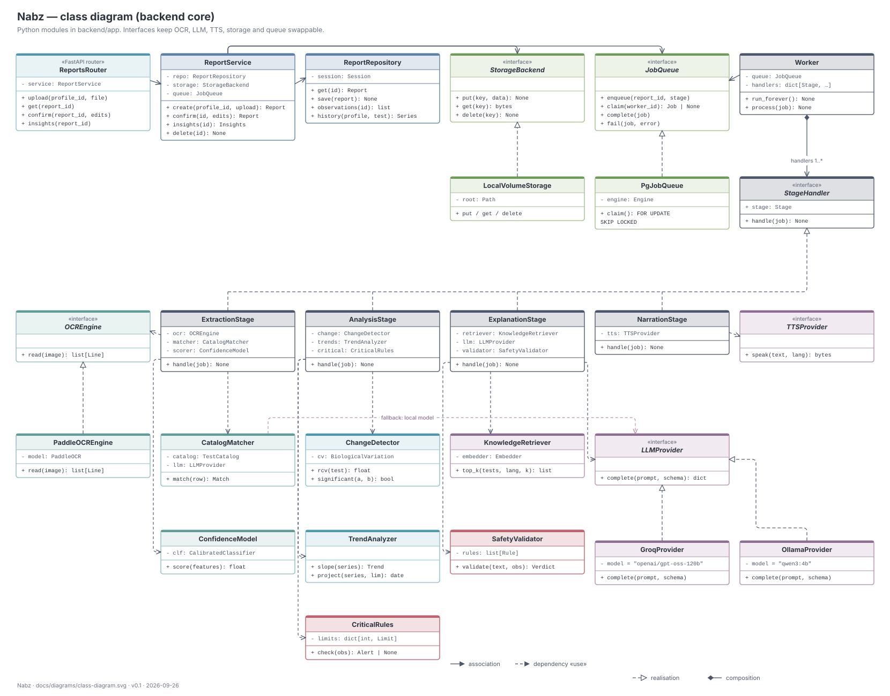

# 06 · Detailed design

| | |
|---|---|
| **Document ID** | NBZ-DOC-06 |
| **Version** | 0.1 · draft |
| **Last updated** | 2026-09-26 |

## 1. Repository layout

```text
nabz/
├── compose.yaml                 # all services (db, api; worker, web, ollama as they land)
├── .env.example                 # configuration template — copy to .env
├── infra/db/init/               # extension setup on first database start
├── backend/                     # Python 3.12, uv-managed
│   ├── Dockerfile
│   ├── pyproject.toml, uv.lock
│   ├── app/
│   │   ├── main.py              # FastAPI app factory, routers, health
│   │   ├── cli.py               # management commands (seed-catalogue, …)
│   │   ├── core/                # config, logging, security, i18n keys
│   │   ├── db.py                # engine + session
│   │   ├── catalogue/           # CSV loader + validation, unit normalisation/conversion, LOINC check, seeding
│   │   ├── models/              # SQLAlchemy ORM (one module per domain)
│   │   ├── schemas/             # Pydantic request/response + explanation JSON schema
│   │   ├── api/                 # routers: auth, profiles, reports, insights, admin
│   │   ├── services/            # ReportService, ConsentService, ShareService
│   │   ├── worker/              # Worker loop, JobQueue, stage handlers
│   │   ├── extraction/          # document (PDF text layer / OCR), preprocess (deskew, quality), layout, parser
│   │   │                        #   Sprint 3 adds CatalogMatcher and ConfidenceModel
│   │   ├── storage.py           # LocalVolumeStorage for the uploads volume
│   │   ├── analysis/            # RangeClassifier, CriticalRules, ChangeDetector, TrendAnalyzer, Percentiles
│   │   ├── explanation/         # KnowledgeRetriever, PromptBuilder, LLMProvider, SafetyValidator
│   │   └── narration/           # TTSProvider implementations
│   ├── tools/synthetic/         # synthetic report generator (PDF + ground truth)
│   ├── tools/eval/              # extraction evaluation against ground truth (text / ocr / photo modes)
│   ├── migrations/              # Alembic
│   └── tests/                   # unit, integration (throwaway Postgres database), eval harness
├── frontend/                    # React + TS + Vite (Sprint 3)
│   └── src/{app,features,three,i18n,api}
├── data/
│   ├── catalogue/               # tests, aliases, units, ranges, critical limits (CSV)
│   ├── knowledge/               # curated source texts + licence manifest
│   ├── synthetic/               # samples/ committed; generated sets git-ignored
│   └── private/                 # consented real samples — git-ignored, encrypted
└── docs/                        # this documentation
```

## 2. Class design



The diagram shows the backend core in three layers:

- **Request path** (top row). `ReportsRouter` → `ReportService` → repository, storage and queue. The service never calls the worker. It only enqueues.
- **Worker** (right). `Worker` owns one `StageHandler` per stage (composition) and runs whatever the queue hands it. The four stages implement the same interface, so adding a stage (for example "translate") means adding a class and a row in the `job_stage` enum.
- **Collaborators** (bottom). Every external or swappable dependency is an interface: `OCREngine`, `LLMProvider`, `TTSProvider`, `StorageBackend`, `JobQueue`. Tests use in-memory fakes. Production uses RapidOCR, Groq or Ollama, local volume storage and the Postgres queue.

## 3. Key interfaces

```python
class LLMProvider(Protocol):
    """A text model that returns JSON matching a schema."""
    name: str
    def complete(self, system: str, prompt: str, schema: dict, *, max_tokens: int) -> dict: ...


class OCREngine(Protocol):
    def read(self, image: np.ndarray) -> list[TextLine]: ...   # text, box, confidence


class StageHandler(Protocol):
    stage: Stage
    def handle(self, job: Job) -> None: ...                    # idempotent per report_id


class JobQueue(Protocol):
    def enqueue(self, report_id: UUID, stage: Stage, *, delay: timedelta = ...) -> None: ...
    def claim(self, worker_id: str) -> Job | None: ...
    def complete(self, job: Job) -> None: ...
    def fail(self, job: Job, error: str) -> None: ...          # schedules retry or marks failed
```

Implementations are chosen in one place, `app/core/wiring.py`, from settings. Nothing else reads `LLM_PROVIDER` directly.

## 4. REST API

Base path `/v1`. JSON everywhere except uploads (multipart) and status streams (SSE). Every endpoint except auth needs a session. Every `profile_id` and `report_id` is checked for ownership.

| Method | Path | Purpose | FR |
|---|---|---|---|
| POST | `/auth/register`, `/auth/login`, `/auth/logout` | Account and session | FR-01 |
| GET / POST | `/profiles` | List / create profiles | FR-02 |
| PATCH / DELETE | `/profiles/{id}` | Edit / hard-delete a profile | FR-02, FR-33 |
| GET / PUT | `/profiles/{id}/consents` | Read / set consent per purpose | FR-03 |
| POST | `/profiles/{id}/reports` | Upload a report | FR-06 |
| GET | `/profiles/{id}/reports` | List reports (timeline) | FR-29 |
| GET | `/reports/{id}` | Status + draft observations; SSE when `Accept: text/event-stream` | FR-12, FR-13 |
| GET | `/reports/{id}/pages/{n}` | Page image for the review screen | FR-13 |
| POST | `/reports/{id}/confirm` | Edits + confirmation → analyse | FR-14, FR-15 |
| GET | `/reports/{id}/insights?lang=` | Organ statuses, observations, trends, explanation, audio | FR-16–FR-28 |
| GET | `/profiles/{id}/trends/{test_id}` | Full series + trend insight | FR-18, FR-19 |
| POST | `/reports/{id}/share` · DELETE `/shares/{id}` | Create / revoke a share link | FR-34 |
| GET | `/shared/{token}` | Doctor's read-only view (no session) | FR-34 |
| GET | `/profiles/{id}/export?format=json\|pdf` | Data export | FR-32 |
| DELETE | `/reports/{id}` | Hard delete a report | FR-33 |
| POST | `/explanations/{id}/feedback` | Rating + comment | — |
| CRUD | `/admin/tests`, `/admin/ranges`, `/admin/critical-limits`, `/admin/kb` | Catalogue and knowledge base | FR-35, FR-36 |
| GET | `/health`, `/health/ready` | Liveness / readiness | — |

Errors follow RFC 9457 problem details (`application/problem+json`) with a stable `type` URI and never echo health data.

## 5. Explanation contract

The LLM must return this JSON, enforced with structured outputs and then validated:

```json
{
  "language": "hi",
  "summary": "…2–4 sentences…",
  "per_test": [
    {
      "test_id": 123,
      "status": "high",
      "what_it_measures": "…",
      "what_this_result_means": "…",
      "citations": ["kb_chunk:5f1c…"]
    }
  ],
  "doctor_questions": ["…", "…", "…"],
  "disclaimer_key": "not_a_diagnosis_v1"
}
```

**Prompt structure.** The system prompt is fixed and versioned (`prompt_version`), with role, audience, tone, forbidden content and output schema. It is followed by retrieved passages, each tagged with its ID, and then the de-identified values table with computed insights. The system prompt and passages come first so prompt caching can reuse them across reports.

**Validator rules** (all must pass):

1. Every number in the text equals a number in the input table, after unit formatting.
2. No banned intent: diagnosis ("you have…"), treatment or dosing, and reassurance about critical values.
3. Every `per_test` entry cites at least one passage that was actually provided.
4. The status words match the computed status.
5. The disclaimer key is present.
6. The LLM judge, at low effort, returns `safe` on the combined text.

On failure the explanation is replaced by a template that is filled only from computed values. It is stored with `safety_status = fallback`.

## 6. Frontend structure (Sprint 3+)

| Area | Main components |
|---|---|
| `features/upload` | Camera/file picker, client-side quality check (blur and brightness heuristics on a canvas), progress |
| `features/review` | Page viewer with highlight boxes, editable observation table, confidence badges |
| `features/body` | `<BodyScene>` (R3F canvas), `<Organ>` meshes with status material, camera rig with fly-to, detail card |
| `features/timeline` | Report scrubber driving the body scene and trend charts |
| `features/explain` | Explanation reader, language switch, audio player, doctor questions (print view) |
| `features/admin` | Catalogue and knowledge-base tables |
| `three/` | Material library (status colours from the Nord palette), bloom and outline post-processing, 2D fallback |
| `i18n/` | `en`, `hi`, `or` bundles; Noto Sans Devanagari and Noto Sans Oriya fonts |

## 7. Configuration

All configuration comes from environment variables (see `.env.example`) through `app/core/config.py`. There are no configuration files inside images. Secrets are never logged. The effective configuration, with secrets masked, is logged once at start-up.

## Revision history

| Version | Date | Change |
|---|---|---|
| 0.1 | 2026-09-26 | First draft |
