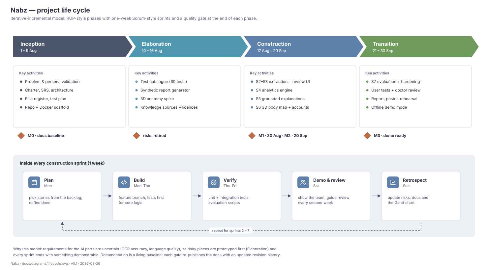
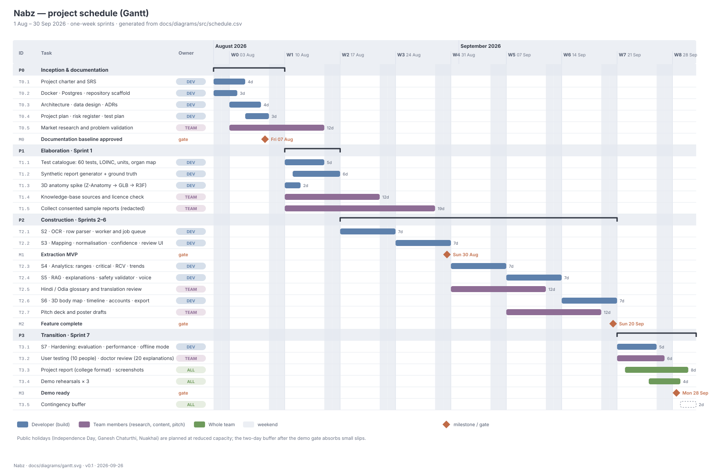

# 07 · Project plan

| | |
|---|---|
| **Document ID** | NBZ-DOC-07 |
| **Version** | 0.1 · draft (baseline at M0) |
| **Schedule source** | [`diagrams/src/schedule.csv`](diagrams/src/schedule.csv) |
| **Last updated** | 2026-09-26 |

## 1. Life-cycle model

Nabz follows an **iterative-incremental** model. It uses four RUP-style phases (Inception, Elaboration, Construction, Transition), each ending in a quality gate, and inside them one-week, Scrum-style sprints.

**Why this model and not waterfall or pure Scrum:**

- **Uncertain AI requirements.** Nobody knows yet how well OCR will read a folded photo or how good Odia output will be. Elaboration exists to *prototype the riskiest parts first* and adjust scope before building on them.
- **Incremental value.** Every sprint ends with something demonstrable. At M1 the product already reads reports, even before explanations exist, so a schedule slip removes features, not the demo.
- **Academic checkpoints.** Phase gates line up with guide reviews, and the documentation baseline is re-published at each gate.

## 2. Phases and gates

| Phase | Dates | Goal | Exit criteria (gate) |
|---|---|---|---|
| Inception | 1 – 9 Aug | Agree what to build and how | **M0.** Docs 01–11 and ADRs reviewed by the guide; repository and Docker stack running; risks logged |
| Elaboration (S1) | 10 – 16 Aug | Retire the top technical risks | Catalogue of 60 tests seeded; synthetic generator produces 3 layouts with ground truth; body GLB renders at ≥ 45 fps on the laptop |
| Construction (S2–S6) | 17 Aug – 20 Sep | Build features in priority order | **M1 (30 Aug).** Upload → review works on synthetic and photo sets with measured accuracy. **M2 (20 Sep).** All *Must* FRs done; tests green |
| Transition (S7) | 21 – 30 Sep | Prove it, polish it, present it | **M3 (28 Sep).** Objectives O1–O6 measured; offline demo passes 3 rehearsals; report submitted |

## 3. Work breakdown structure

| WBS | Work package | Owner | Output |
|---|---|---|---|
| 1 | **Project management** | Dev | Plan, risk register, weekly status, gate reviews |
| 2 | **Requirements & design** | Dev | Docs 01–11, ADRs, diagrams |
| 3 | **Platform** | Dev | Docker Compose, Postgres, migrations, CI |
| 4 | **Data foundation** | | |
| 4.1 | Test catalogue & organ mapping | Dev | `data/catalogue/*.csv` |
| 4.2 | Synthetic report generator | Dev | `data/synthetic/` + ground truth |
| 4.3 | Real sample collection (consented, redacted) | Team | `data/private/` (not in git) |
| 4.4 | Knowledge-base sourcing & licence check | Team | `data/knowledge/manifest.csv` |
| 5 | **Extraction** (OCR, parsing, matching, confidence) | Dev | Worker stage + review UI |
| 6 | **Analysis** (ranges, critical, RCV, trends, percentiles) | Dev | Worker stage + tests |
| 7 | **Explanation** (RAG, prompts, validator, TTS) | Dev | Worker stage + red-team suite |
| 8 | **Experience** (3D body map, timeline, i18n, accessibility) | Dev | Web app |
| 9 | **Accounts & data rights** (auth, profiles, consent, export, delete) | Dev | API + UI |
| 10 | **Validation** | | |
| 10.1 | Evaluation harness & metrics | Dev | `backend/tests/eval` + report |
| 10.2 | User testing (10 people) | Team | Findings + timing data |
| 10.3 | Clinical review (20 explanations) | Team | Reviewer sheet |
| 10.4 | Translation review (Hindi, Odia) | Team | Glossary + ratings |
| 11 | **Communication** | Team + Dev | Pitch deck, poster, demo script, college report |

## 4. Schedule

| Milestone | Date | Evidence |
|---|---|---|
| M0 · Documentation baseline | Fri 7 Aug 2026 | Signed-off docs; running stack |
| M1 · Extraction MVP | Sun 30 Aug 2026 | Accuracy report on evaluation set; demo of upload → review |
| M2 · Feature complete | Sun 20 Sep 2026 | All *Must* FRs pass tests |
| M3 · Demo ready | Mon 28 Sep 2026 | Evaluation report; 3 successful rehearsals; report submitted |

**Critical path.** Catalogue (T1.1) → OCR and parsing (T2.1) → mapping and review UI (T2.2) → analytics (T2.3) → explanations (T2.4) → 3D body map and accounts (T2.6) → hardening (T3.1). Team tasks run in parallel and are off the critical path, but feed it: sample reports into evaluation, knowledge sources into RAG, and the glossary into translations.

**Compression.** The plan fits 1 Aug – 30 Sep 2026 (nine weeks), so the 3D body map, timeline, accounts and export share one sprint (S6). That sprint carries the most schedule risk; its *Could* items (share links, 2D fallback) are the first to drop.

**Buffer.** Public holidays (Independence Day, Ganesh Chaturthi, Nuakhai) are planned at reduced capacity. Two contingency days sit after the demo gate. If a sprint slips by more than two days, the lowest-priority *Should* or *Could* items of the next sprint are dropped, not the gate.

## 5. Sprint cadence

| Day | Ceremony | Output |
|---|---|---|
| Monday | Sprint planning (30 min) | Sprint goal + chosen backlog items |
| Daily | Commit + short log in `CHANGELOG.md` | Visible progress |
| Saturday | Demo to the team; guide review every second week | Feedback captured as issues |
| Sunday | Retrospective (15 min) | Risk register, Gantt and docs updated |

**Definition of Done** (every backlog item):

1. Code merged to `main` through a pull request with a green CI run (ruff, mypy, pytest).
2. Tests cover the new behaviour; evaluation metrics re-run if extraction or explanation changed.
3. Docs updated if an interface, schema or requirement changed.
4. Works via `docker compose up` on a clean clone.

## 6. RACI

R = responsible · A = accountable · C = consulted · I = informed. The team-member roles are placeholders to be assigned.

| Activity | Developer | Team member A (pitch lead) | Team member B (research & validation) | Team member C (content & design) | Project guide |
|---|---|---|---|---|---|
| Requirements & design docs | R/A | C | C | I | C |
| All engineering (WBS 3, 5–9) | R/A | I | I | I | I |
| Test catalogue & synthetic data | R/A | I | C | C | I |
| Sample report collection & consent | C | I | R/A | C | I |
| Knowledge-base sourcing & licences | C | I | R/A | C | I |
| Hindi/Odia glossary & translation review | C | I | C | R/A | I |
| Clinical review of explanations | C | I | R/A | I | I |
| User testing | C | C | R/A | C | I |
| Pitch deck, poster, demo script | C | R/A | C | R | I |
| College report | R (technical chapters) | C | R (survey, testing) | R/A (assembly, format) | C |
| Gate reviews | R | I | I | I | A |

## 7. Communication plan

| What | Who | When | Channel |
|---|---|---|---|
| Sprint demo | Whole team | Weekly, Saturday | In person / call |
| Status note (done, next, blocked, risks) | Developer → guide | Fortnightly | Email or message |
| Gate review | Team + guide | M0, M1, M2, M3 | Meeting with the docs baseline |
| Decisions | Developer | When made | ADR in `docs/adr/` |

## 8. Tools

| Purpose | Tool |
|---|---|
| Code & reviews | Git + GitHub (pull requests, issues, project board) |
| CI | GitHub Actions: lint, type-check, tests, diagram build check |
| Environment | Docker Desktop + Compose |
| Docs & figures | Markdown + generated SVG (this folder) |
| Design | Figma (UI mock-ups), Blender (anatomy model preparation) |

## 9. Change control

- **Scope changes** after M0 need an entry in the charter's revision history, with the requirement IDs affected and the schedule impact.
- **Schedule changes** are made in `schedule.csv`, then the chart is regenerated. Never edit the SVG by hand.
- **Architecture changes** need a new ADR that supersedes the old one.

## Revision history

| Version | Date | Change |
|---|---|---|
| 0.1 | 2026-09-26 | First draft |
